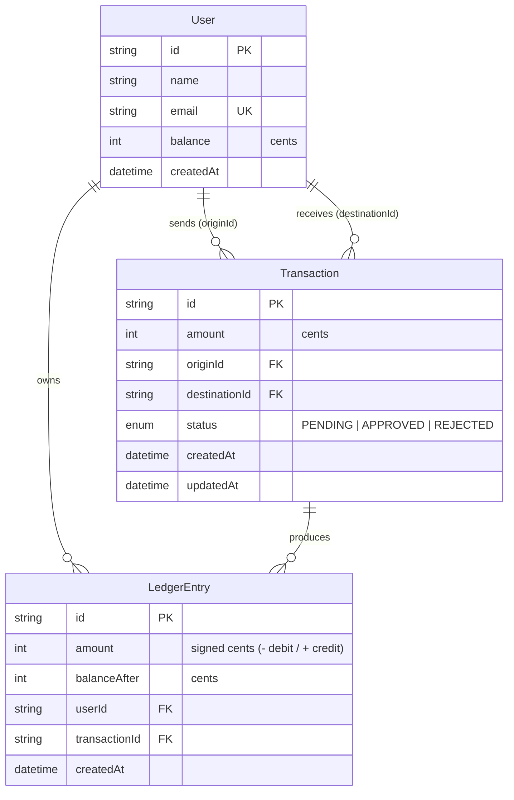

# Transfers API

Internal P2P payments API for virtual ARS accounts. Hexagonal architecture
(`domain` / `application` / `ports` / `infrastructure`) on **Fastify 5 +
TypeScript + Prisma 6 + PostgreSQL 16**.


---

## Data model


---

## Run locally

PostgreSQL still runs in Docker; everything else runs on your machine.

```bash
cp env.example .env             # local processes read .env (loaded via dotenv)
docker compose up -d db         # start Postgres only
npm install
npm run db:setup                # apply migrations + seed sample users
npm run dev                     # start in watch mode on :3000
```

> `npm run dev`, `npm start`, and `npm run seed` load `.env` through `dotenv`.
> The Prisma CLI (`prisma migrate`) loads it on its own. In Docker there is no
> `.env`; the injected environment is used instead.

---

This builds the app, starts PostgreSQL (with a healthcheck), applies migrations,
seeds sample users, and serves the API on **http://localhost:3000**.

- Swagger UI: http://localhost:3000/docs
- OpenAPI JSON: http://localhost:3000/docs/json
- Health: http://localhost:3000/health
